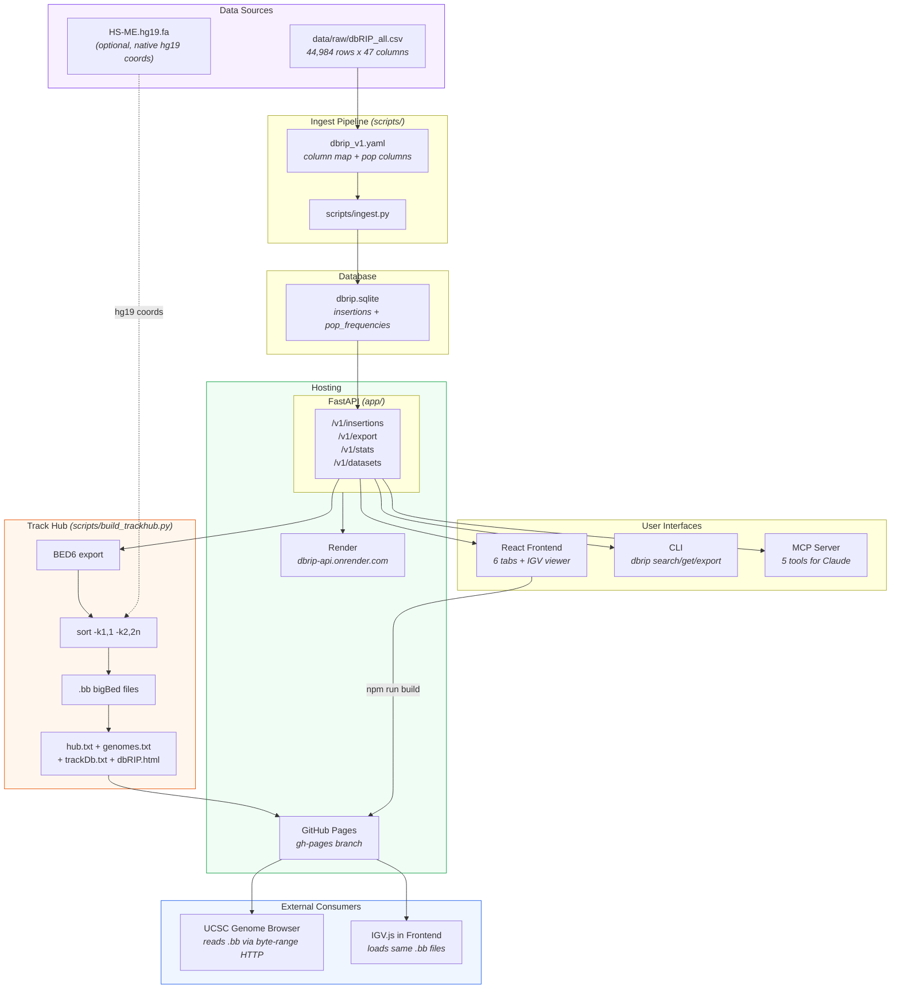

# What's Built / What's Next

## Architecture

## What's Built

| Layer | Status | Tests |
|-------|--------|-------|
| Ingest pipeline (CSV → SQLite) | Done | 13 |
| FastAPI backend (7 endpoints) | Done | 26 |
| CLI (`dbrip` — 5 commands) | Done | 21 |
| React frontend (6 tabs, IGV viewer) | Done | — |
| Docker + Render deployment | Done | — |
| MCP server (5 tools, HTTP transport) | Done | — |

---

## In Progress — Track Hub + GitHub Pages

**Goal:** Lab commits updated CSV → CI rebuilds everything → UCSC Track Hub + frontend auto-deploy to GitHub Pages.

| Group | Files | Status |
|-------|-------|--------|
| 1. Hub templates | `data/hub/templates/` (5 files) | Done |
| 2. Build script | `scripts/build_trackhub.py` + `pyproject.toml` | Not started |
| 3. Frontend | `client.ts` (env var), `app/main.py` (CORS), `IgvViewer.tsx` (default tracks), `InteractiveSearch.tsx` (UCSC button) | Not started |
| 4. CI/CD | `.github/workflows/build-trackhub.yml` + `.gitignore` | Not started |
| 5. Docs | `GUIDE.md` + `README.md` | Not started |

**Design spec:** `NOTEBOOK/TRACK_HUB.md`

**Key decisions:**
- BED6 only (no AutoSQL) — keeps pipeline simple; add AutoSQL later for richer UCSC popups
- ME types discovered dynamically from `GET /v1/stats?by=me_type` — ALU, LINE1, SVA, HERVK all get tracks automatically
- hg19 via native FASTA coordinates (HS-ME.hg19.fa header parsing), not liftOver
- Frontend on GitHub Pages with `VITE_API_URL` env var; API stays on Render
- IGV viewer auto-loads dbRIP bigBed tracks from deployed hub
- "Open in UCSC" deep-link button per insertion row

**URLs after deployment:**
- Frontend: `https://aryan-jhaveri.github.io/dbRIP/`
- Track Hub: `https://aryan-jhaveri.github.io/dbRIP/hub/hub.txt`
- UCSC load: `https://genome.ucsc.edu/cgi-bin/hgTracks?hubUrl=https://aryan-jhaveri.github.io/dbRIP/hub/hub.txt`

---

## Roadmap

| Priority | What | Effort | Notes |
|----------|------|--------|-------|
| **Next** | AutoSQL — rich UCSC click popups (BED6+N) | Medium | Requires `bed6ext` API format + `.as` schema file |
| **Next** | Column sort + filter dropdowns in DataTable | Medium | API needs `sort_by` / `sort_order` params |
| 3 | Deploy MCP server publicly | Small | Add `render.yaml` service entry |
| 4 | Additional datasets (euL1db) | Small | Manifest + loader class per dataset |
| 5 | Manifest-driven frontend | Medium | `GET /v1/schema` endpoint; wait for 2nd dataset |
| 6 | hg19 Track Hub (native FASTA coords) | Small | Download HS-ME.hg19.fa → `--hg19-fasta` flag |
| 7 | Enrichment / annotations (OMIM, GTEx) | Large | New `enrichment` table + external data sources |
| 8 | Population frequency tracks in UCSC | Large | Separate bigBed per super-population, colored by AF |
| 9 | CHM13 liftover | Medium | Chain file approach; native coords may not exist |
| 10 | UCSC public hub listing | Small | Email genome-www@soe.ucsc.edu once hub is stable |
